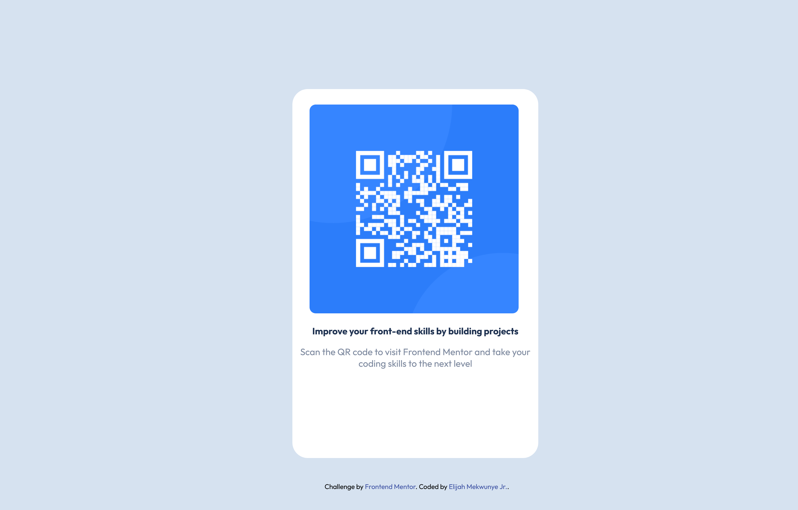

# Frontend Mentor - QR code component solution

This is a solution to the [QR code component challenge on Frontend Mentor](https://www.frontendmentor.io/challenges/qr-code-component-iux_sIO_H). Frontend Mentor challenges help you improve your coding skills by building realistic projects. 

## Table of contents

- [Overview](#overview)
  - [Screenshot](#screenshot)
  - [Links](#links)
- [My process](#my-process)
  - [Built with](#built-with)
  - [What I learned](#what-i-learned)
  - [Continued development](#continued-development)
  - [Useful resources](#useful-resources)
- [Author](#author)
- [Acknowledgments](#acknowledgments)

## Overview
I took this challenge from Front End Mentors to improve both my programming and web design skills.
### Screenshot

)

### Links

- Solution URL: 
- Live Site URL: https://ejmatter.github.io/QR-Code-Component/

## My process
I started by looking at the project parameters to understand what the project would require of me. I looked at the design picture to get an idea of what I wanted the layout of this project to be. I then worked on the HTML code to make sure I had all the components that I needed. I then created the CSS style sheet to add styling and adjustments to the website.

### Built with

- HTML5 markup
- CSS custom properties - for fonts and div placement.
- Google Fonts -  to have the Outfit font embedded into the project.

### What I learned
In taking on this challenge I was able to solidify my skills in CSS styling to be able to make the stylized QR Code component. I started by creating a wraparound div for the background component. This allowed me to create a class for the background specifically to create the space that I would need for the layout. I used the margin element to style the positioning of the divs and the image component. The thing that I am most proud of learning is how to use the MEDIA tag. Learning this helped me to style the website for mobile and will only take effect on screens less than or equal to the max width.

```css
@media screen and (max-width: 896px){ 
      .attribution { 
        font-size: 10px;
        margin-top: 40px;
        text-align: center;
    }

    .attribution a {
        color: hsl(228, 45%, 44%);
        text-decoration: none; 
        }
    .attribution a:hover {
        color: hsl(0, 0%, 100%);
    }
    .background-container {
        background-color: hsl(212, 45%, 89%);
        display: inline-block;
        height: 375px;
        width: 375px;
    }
    .improve{
        color: hsl(218, 44%, 22%);
        text-align: center;
    }
    .qr-code{
        border-radius: 10px;
        margin-top: 25px;
        margin-left: 20px;
        position: relative;
        width: 85%;
    }
    .scan{
        color: hsl(220, 15%, 55%);
        text-align: center;
    }
    .content-container {
        background-color: hsl(0, 0%, 100%);
        border-radius: 25px;
        display: inline-block;
        height: 400px;
        width: 225px;
        margin-top: 20px;
        margin-left: 60px; 
        position: relative;
} 
```

### Continued development

I would like to continue learning how to use margin, padding and positioning to style a webpage to be more reactive and to be able to change size depending on the size of the window of the webpage. I would also like to improve my mobile-first design practices to save me time when it comes to mobile design. 

### Useful resources

-  W3 Schools https://www.w3schools.com/css/css3_borders.asp - This helped me figure out how to style the corners for the border of my div and the picture corners.
-  W3 Schools https://www.w3schools.com/css/tryit.asp?filename=trycss3_border-radius - This helped me to test out the code for the corners to make sure that the project looked like I needed it to.

## Author

- LinkedIn - Elijah Mekwunye Jr. https://www.linkedin.com/in/elijah-mekwunye-jr/
- Frontend Mentor - @ejmatter https://www.frontendmentor.io/profile/ejmatter

## Acknowledgments
I would like to thank Angela Yu of the App Brewery for The Complete 2023 Web Development Bootcamp course I took through Udemy. This course I bought taught me the skills I used to complete this challenge.
